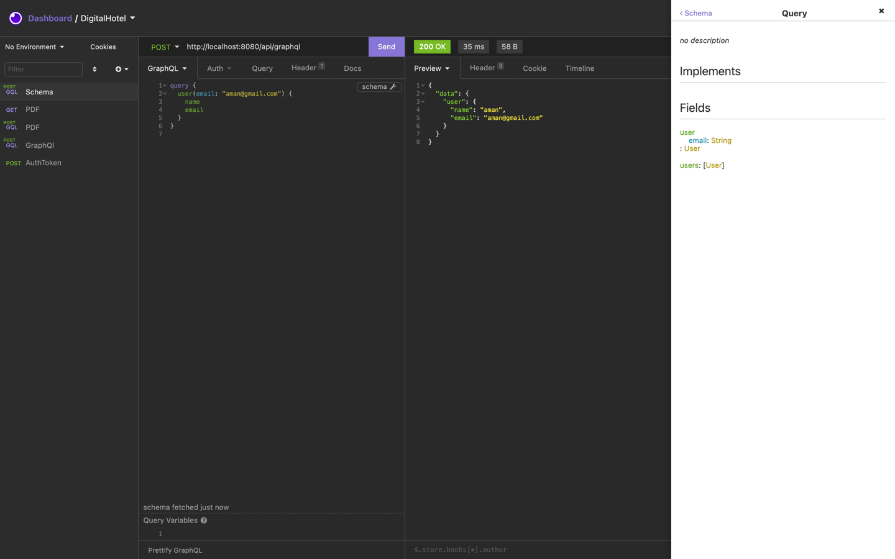

# Getting Started with GraphQl:Java

## 1. Add maven dependency

```xml

<dependency>
    <groupId>com.graphql-java</groupId>
    <artifactId>graphql-java</artifactId>
    <version>16.2</version>
</dependency>
```

## 2. Create GraphQL ObjectType and DataFetchers

1. Define GraphQLObjectType for User, for this I'm creating a class that will help to build different types and being
   used by SchemaBuilderHelper.

```java
import graphql.Scalars;
import graphql.schema.GraphQLObjectType;
import org.springframework.stereotype.Component;

@Component
public class MyGraphQLObjectTypes {

    public GraphQLObjectType getUserType() {
        return new GraphQLObjectType.Builder()
                .name("User")
                .field(builder ->
                        builder
                                .name("name")
                                .type(Scalars.GraphQLString)
                )
                .field(builder ->
                        builder
                                .name("email")
                                .type(Scalars.GraphQLString)
                ).build();
    }
    // define your own data type for your Model classes 
}
```

getUserType method will return GraphQLObjectType which is equivalent to below user class

```java
import lombok.Data;

@Data
public class User {
    private String name;
    private String email;
}
```

2. Now we will create a user field in root query of type User, which we just created in above step

```java

import graphql.Scalars;
import graphql.schema.*;
import lombok.RequiredArgsConstructor;
import org.springframework.stereotype.Component;

import java.util.HashMap;

@RequiredArgsConstructor
@Component
public class SchemaBuilderHelper {
    private final MyGraphQLObjectTypes myGraphQLObjectTypes;

    public void buildQuery(GraphQLObjectType.Builder queryBuilder, GraphQLCodeRegistry.Builder codeRegistry) {
        queryBuilder.name("Query");

        buildUserQuery(queryBuilder, codeRegistry);

    }

    private void buildUserQuery(GraphQLObjectType.Builder queryBuilder, GraphQLCodeRegistry.Builder codeRegistry) {

        GraphQLObjectType userType = myGraphQLObjectTypes.getUserType();

        codeRegistry.dataFetcher(FieldCoordinates.coordinates("Query", "user"), (DataFetcher<HashMap<String, Object>>) dataFetchingEnvironment -> {
            HashMap<String, Object> res = new HashMap<>();
            res.put("name", "Ram");
            res.put("email", "Ram@gmail.com");
            return res;
        });

        queryBuilder.field(builder -> builder
                .name("user")
                .type(userType));
    }


}
```

For now, I have created a static dataFetcher for user(type User) but it can be replaced with a dynamic data source.

## 3. Create another class GraphQLConfig

This class will be going to use SchemaBuilderHelper to build GraphQLSchema and creating spring bean for it and also for
GraphQL which is used for executing graphQL query.

```java
import com.example.graphqljava.graphql.SchemaBuilderHelper;
import graphql.GraphQL;
import graphql.schema.GraphQLCodeRegistry;
import graphql.schema.GraphQLObjectType;
import graphql.schema.GraphQLSchema;
import graphql.schema.idl.SchemaPrinter;
import org.springframework.context.annotation.Bean;
import org.springframework.context.annotation.Configuration;

@Configuration
public class GraphQLConfig {

    @Bean
    public SchemaPrinter getSchemaPrinter() {
        return new SchemaPrinter();
    }

    @Bean
    public GraphQLSchema getGraphQLSchema(SchemaBuilderHelper schemaBuilderHelper) {
        GraphQLCodeRegistry.Builder codeRegistry = GraphQLCodeRegistry.newCodeRegistry();
        GraphQLObjectType.Builder queryBuilder = GraphQLObjectType.newObject();
        //build query type
        schemaBuilderHelper.buildQuery(queryBuilder, codeRegistry);

        return GraphQLSchema.newSchema()
                .query(queryBuilder.build())
                .codeRegistry(codeRegistry.build())
                .build();
    }

    @Bean
    public GraphQL getGraphQl(GraphQLSchema graphQLSchema) {
        return GraphQL.newGraphQL(graphQLSchema).build();
    }
}
```

## 4. Create model class GraphQLRequest

This will represent the graphQl request sent by client.

```java
import lombok.Data;

@Data
public class GraphQLRequest {
   private String query;
   private String operationName;
   private Map<String, Object> variables;
}
```

## 5. Let's create a controller class for handling GraphQL request(GraphQLController)

### This GraphQLController will contain basically two endpoints

* POST endpoint : for accepting GraphQL request and return data
* GET endpoint : for returning GraphQL schema

```java

@RestController
@RequiredArgsConstructor
@RequestMapping("/api/graphql")
public class GraphQLController {

    private final GraphQL graphQL;
    private final GraphQLSchema schema;
    private final SchemaPrinter schemaPrinter;

    @GetMapping(produces = MediaType.TEXT_PLAIN_VALUE)
    public String schema() {
        return schemaPrinter.print(schema);
    }

    @PostMapping
    public Object execute(@RequestBody GraphQLRequest graphQLRequest) {
        Map<String, Object> variables = Optional.ofNullable(graphQLRequest.getVariables())
                .orElse(new HashMap<>());

        ExecutionInput input = new ExecutionInput
                .Builder()
                .query(graphQLRequest.getQuery())
                .operationName(graphQLRequest.getOperationName())
                .variables(variables).build();

        ExecutionResult execute = graphQL.execute(input);

        Map<String, Object> result = new HashMap<>();
        result.put("data", execute.getData());

        //set error if any
        if (!execute.getErrors().isEmpty()) {
            result.put("error", execute.getErrors());
        }
        return result;
    }

}

```
# Now we have build simple Spring app with graphQL 

